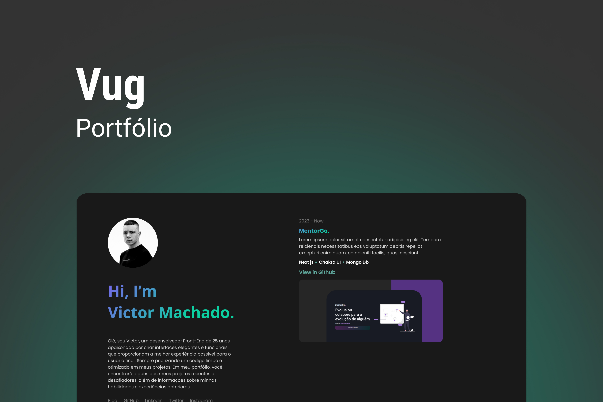

# Victor Machado.

    

---

 

### 🛠 Tecnologias

As seguintes ferramentas foram usadas para a construção do projeto:

- [Next.js](https://beta.nextjs.org/docs/routing/pages-and-layouts)
- [TypeScript](https://www.typescriptlang.org/)
- [Chakra UI](https://chakra-ui.com/)

 

### 🔗 Deploy

O deploy do projeto foi feito na a Vercel, você pode acessar e conferir acessando o link abaixo:

- [Vercel](https://namevug.vercel.app/)
